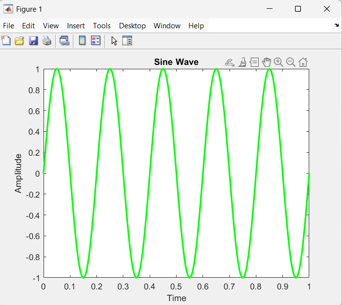
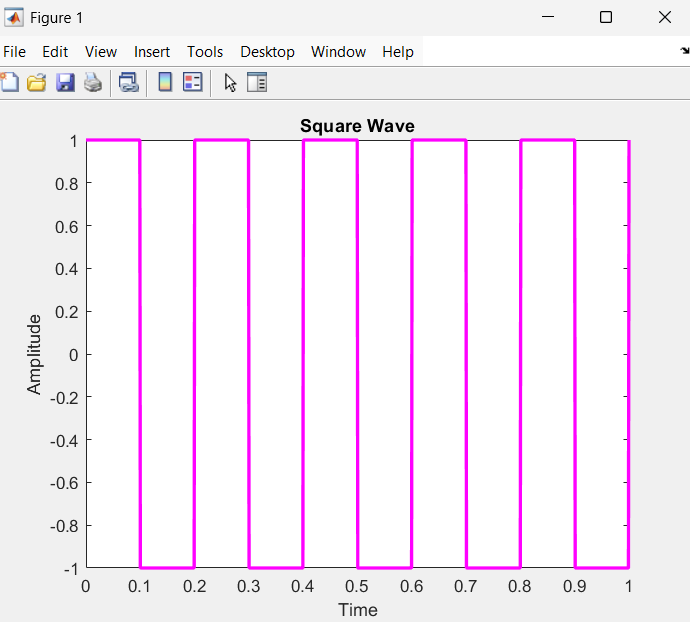

# Experiment 1
## Sine Wave
``` matlab
clc;
clear all;
close all;

f=5;
a=2;
t=linspace(0, 1, 1000);
y=sin(2*pi*f*t);
plot(t, y, "g", "LineWidth",2);
title("Sine Wave");
xlabel("Time");
ylabel("Amplitude");
```



## Square Wave
``` matlab
clc;
clear all;
close all;

f=5;
a=2;
t=linspace(0, 1, 1000);
y=square(2*pi*f*t);
plot(t, y, "m", "LineWidth",2);
title("Square Wave");
xlabel("Time");
ylabel("Amplitude");
```

