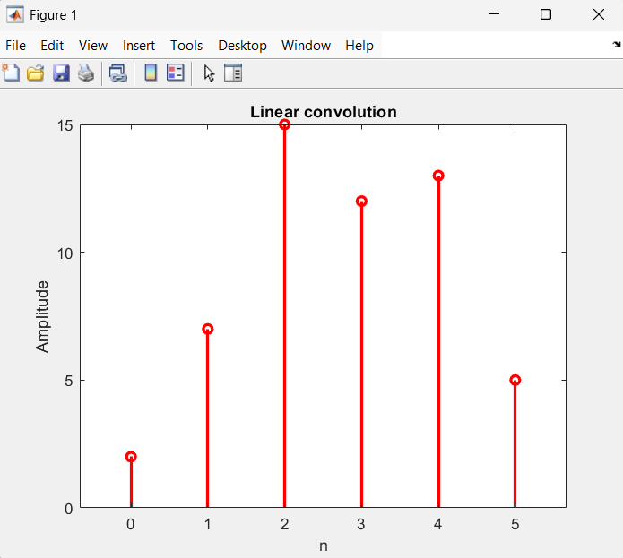
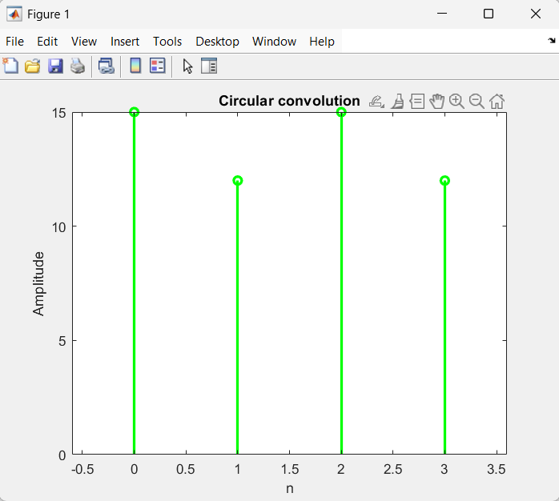

# Experiment 2
## Linear Convolution
```matlab
clc;
clear all;
close all;

x=[2 1 2 1];
y=[1 3 5];
N=length(x);
h=conv(x, y);
disp("Linear convolution results:_");
disp(h);
n=0:length(h)-1;
stem(n, h,"r", "LineWidth", 2);
title("Linear convolution");
xlabel("n");
ylabel("Amplitude");

```
```matlab
Linear convolution results:_
     2     7    15    12    13     5

```


## Circular Convolution
```matlab
clc;
clear all;
close all;

x=[2 1 2 1];
y=[1 3 5];
N=length(x);
h=cconv(x, y, N);
disp("Circular convolution results:_");
disp(h);
n=0:N-1;
stem(n, h,"g", "LineWidth", 2);
title("Circular convolution");

xlabel("n");
ylabel("Amplitude");
```
```matlab
Circular convolution results:_
    15    12    15    12

```

