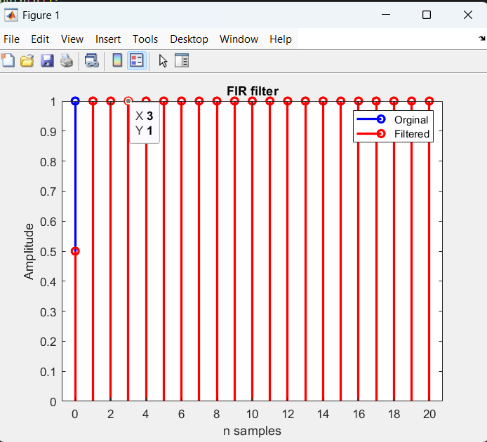
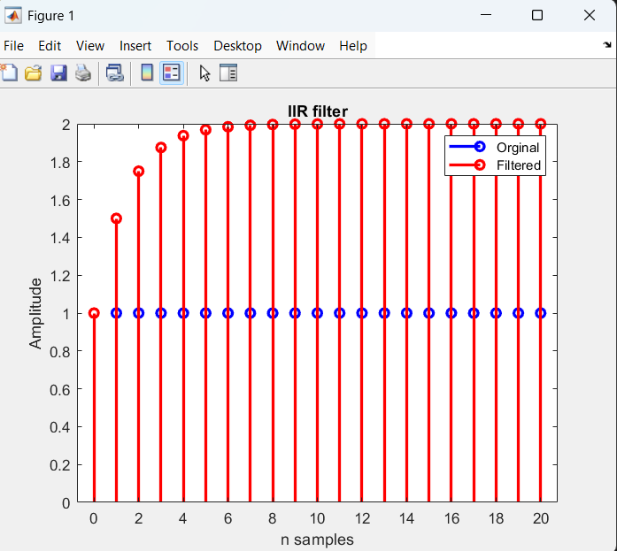

# Experiment 3
## FIR 
```matlab
n=0:20;
x=ones(1, length(n));
y=filter([0.5 0.5],1, x);
stem(n, x,"b" ,"LineWidth",2,"DisplayName", "Orginal");
hold on;
stem(n, y,"r" ,LineWidth=2, DisplayName="Filtered");
title("FIR filter");
xlabel("n samples");
ylabel("Amplitude");
legend();
```



## IIR
```matlab
n=0:20;
x=ones(1, length(n));
y=filter(1, [1 -0.5],x);
stem(n, x,"b" ,"LineWidth",2,"DisplayName", "Orginal");
hold on;
stem(n, y,"r" ,LineWidth=2, DisplayName="Filtered");
title("IIR filter");
xlabel("n samples");
ylabel("Amplitude");
legend();
```


