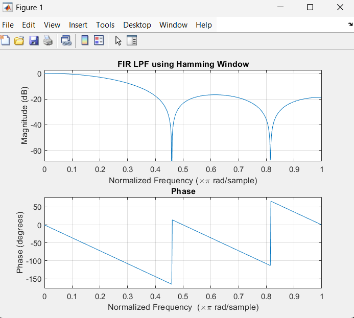
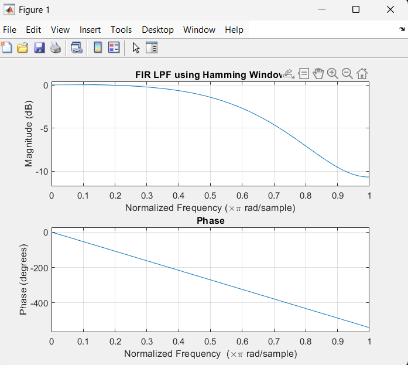

## Hamming window
``` matlab
clc; clear;

M=5;
alpha=2;
wc=pi/4;

n=0:M-1;

hd=sin(wc*(n-alpha))./(pi*(n-alpha));
hd(alpha+1)=wc/pi;

h=hd;

disp(h);

freqz(h,1);
title('FIR LPF using Hamming Window')
xlabel('Normalized Frequency (\times\pi rad/sample)');
ylabel('Magnitude (dB)');
```
``` matlab
 0.1592    0.2251    0.2500    0.2251    0.1592
```


``` matlab
clc;
clear;
close all;

M = 7;
alpha = (M-1)/2;
wc = 3*pi/4;

n = 0:M-1;

hd = sin(wc*(n-alpha))./(pi*(n-alpha));
hd(alpha+1) = wc/pi;

w = hamming(M)';
h = hd .* w;

disp(h)

freqz(h,1)
title('FIR LPF using Hamming Window')
xlabel('Normalized Frequency (\times\pi rad/sample)');
ylabel('Magnitude (dB)');
```
``` matlab
   0.0060   -0.0493    0.1733    0.7500    0.1733   -0.0493    0.0060
```
