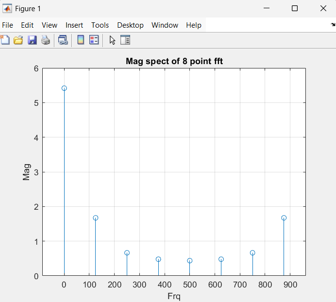

# 8 point fft
``` matlab
clc;
clear all;
close all;
fs=1000;
N=8;
n=0:N-1;
x=sin(2*pi*50*n/fs);
xf=fft(x, N);
magx=abs(xf);
f=(0:N-1)*(fs/N);
stem(f, magx);
xlabel("Frq");
ylabel("Mag");
title("Mag spect of 8 point fft");
grid on;
disp("f \ magx ");
disp([f', magx'])
```
``` matlab
f \ magx 
         0    5.4169
  125.0000    1.6728
  250.0000    0.6641
  375.0000    0.4791
  500.0000    0.4372
  625.0000    0.4791
  750.0000    0.6641
  875.0000    1.6728
```
