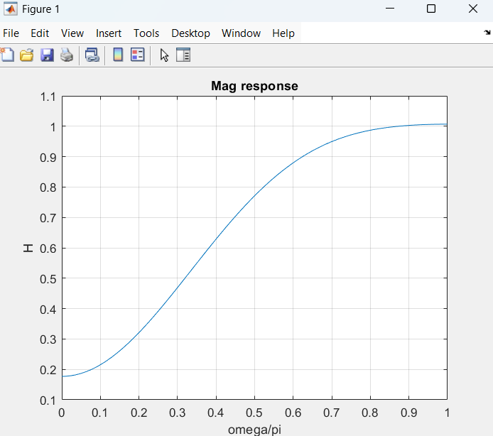

## HPF
``` matlab
clc;
clear all;
close all;

M=7;
wc=1;
tau=(M-1)/2;
n=0:M-1;
hd=zeros(1, M);
for i=1:M
    if (n(i)==tau)
        hd(i)=(1/pi)*(pi-wc);
    else
        hd(i)=(1/(pi*(n(i)-tau)))*(sin(pi*(n(i)-tau))-sin(wc*(n(i)-tau)));
    end
end

w=0.54-0.46*cos((2*pi*n)/(M-1));
h=hd.*w;
disp("Filter coeff h(n):--");
disp(h);
[H, W]=freqz(h, 1, 1024);
figure;
plot(W/pi, abs(H));
grid on;
xlabel("omega/pi");
ylabel("H");
title("Mag response");
```

``` matlab
Filter coeff h(n):--
   -0.0012   -0.0449   -0.2062    0.6817   -0.2062   -0.0449   -0.0012

```
