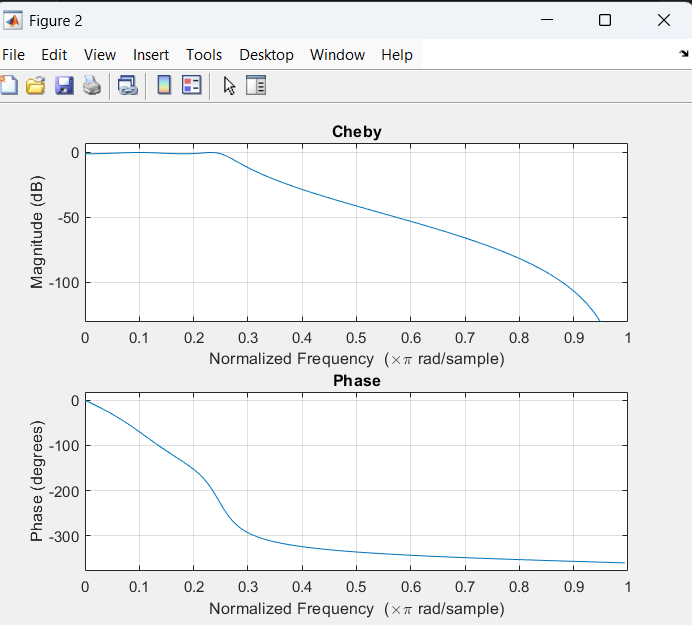
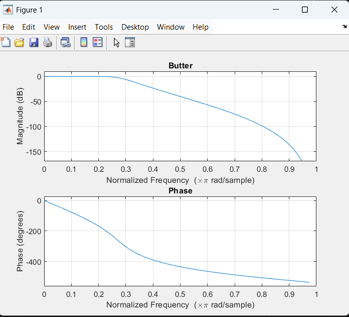

# Butter Cheby1
``` matlab
clc;
clear all;
close all;

fp=1000;
fs=2000;
fsa=8000;
ap=1;
as=40;

wp=fp/(fsa/2);
ws=fs/(fsa/2);

%% Butter
[N1 , wn1]=buttord(wp, ws, ap, as);
[b1, a1]=butter(N1, wn1);

%% cheby
[N2 , wn2]=cheb1ord(wp, ws, ap, as);
[b2, a2]=cheby1(N2, ap, wn2);

disp(['Butterworth Order: ', num2str(N1)]);
disp(['Chebyshev Order: ', num2str(N2)]);


figure;
freqz(b1, a1);
title('Butter');
figure;
freqz(b2, a2);
title('Cheby');


```

``` matlab
Butterworth Order: 6
Chebyshev Order: 4
```

